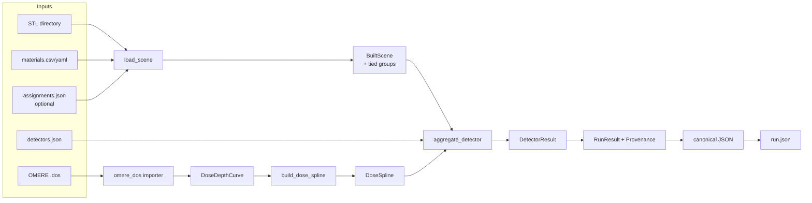
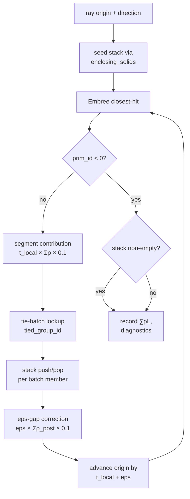
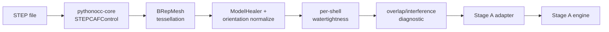

# RaySim Architecture Documentation

## 1. How to Read This Document

This document is the source of architectural truth for RaySim. It describes the codebase as it exists today (Phase 0 + Phase A + Phase B1 + Phase B2 + Phase B3 complete; Phase B4 not yet started) and the patterns the rest of the build will follow. Read it before landing any code change that touches more than one module.

Audience:

- **Contributors** writing or reviewing code — sections 4 (Project Structure), 9–13 (the engine internals) are the daily-driver references.
- **Reviewers** validating that a change conforms to the project's design — section 5 (Core Architecture Principles) and the per-module sections set the contract; section 14 (Determinism) and section 15 (Numerical Precision) set the quality bars.
- **New users** evaluating whether RaySim fits their use case — sections 2–3 give the scope and stack at a glance.

Companion documents:

- `MVP_PLAN.md` — scope, decisions, deferred items (the "what & why").
- `MVP_STEPS.md` — phase-by-phase delivery breakdown (the "how, in order").
- `docs/ARCHI-rules.md` — when and how to update this file.
- `docs/decisions/phase-0.md` — install paths and per-spike outcomes; the reference for "why is healpy optional?" / "why isn't pythonocc-core on PyPI?" types of questions.

---

## 2. Overview

RaySim is a 3D **Total Ionizing Dose (TID)** sector-shielding simulator for spacecraft. Given a CAD model of a spacecraft, a set of detector positions inside it, and a pre-computed solid-sphere dose-depth curve (DDC), it produces an engineering-reviewable per-detector TID estimate.

The math is **deterministic sector analysis**: HEALPix-equal-area rays cast from each detector, accumulated mass-thickness ∑ρL through the geometry along each ray, mm-Al-equivalent conversion, and a 1-D log-cubic spline lookup against the imported DDC. No Monte Carlo. No in-process orbit propagation. No in-process SHIELDOSE-2.

```
DDC (.dos) ──► spline ─┐
                       ▼
STL/STEP ──► BVH ──► HEALPix rays ──► ∑ρL ──► mm-Al ──► dose
materials ─┘                                              │
detectors ─────────────────────────────► aggregate ──► run.json
```

Two stages, two deliverables:

- **Stage A** (complete) — headless `raysim run` CLI consuming STL + CSV + JSON + .dos, emitting canonical `run.json`. Internal milestone, not a user-facing release.
- **Stage B** (post-MVP-Phase-A) — PySide6 desktop shell with STEP ingest, OCCT viewer, material assignment UI, ray-overlay rendering, and a PDF/CSV report bundle. Stage A's engine plugs in unchanged.

---

## 3. Technology Stack

| Concern | Choice | Pin |
|---|---|---|
| Language | Python | 3.11+, 3.12 used locally |
| Package manager | `uv` | latest |
| Build backend | `hatchling` | — |
| Numeric core | `numpy`, `scipy` | numpy ≥1.26, scipy ≥1.11 |
| Schema layer | `pydantic` | ≥2.6 |
| CLI framework | `click` | ≥8.1 |
| Logging | `structlog` | ≥24.1 |
| Mesh I/O | `trimesh` | ≥4.0 |
| YAML I/O | `pyyaml` | ≥6.0 |
| Ray engine (optional) | `embreex` | pyproject minimum ≥2.17; lockfile currently resolves 4.4.0 |
| HEALPix (optional) | `healpy` | ≥1.16 on Linux/macOS only; vendored fallback on Windows |
| CAD (Stage B) | `pythonocc-core` | 7.9.0 conda-forge only |
| UI (Stage B) | `PySide6` + `pyqtgraph` + `matplotlib` | — |
| Reports (Stage B) | `reportlab` | ≥4.0 |
| Lint | `ruff` | ≥0.5 |
| Typecheck | `mypy --strict` | ≥1.10 |
| Tests | `pytest`, `pytest-benchmark` | ≥8.0 |
| CI | GitHub Actions matrix | Ubuntu + Windows × py3.11 + py3.12 |

`embreex` and `healpy` live in the `[ray]` extra; UI/report deps in `[ui]` and `[report]`. Phase A only requires the core deps + `[ray]`. See `docs/decisions/phase-0.md` for per-dependency install-path rationale.

---

## 4. Project Structure

```
raysim/
├── MVP_PLAN.md                    # scope and decisions
├── MVP_STEPS.md                   # delivery breakdown
├── pyproject.toml                 # deps, entry point, lint/test config
├── uv.lock                        # pinned resolution
├── README.md
│
├── src/raysim/
│   ├── __init__.py                # __version__
│   ├── cli/
│   │   ├── main.py                # click group; raysim --version
│   │   └── run.py                 # raysim run subcommand (Phase A.6)
│   ├── env/
│   │   ├── schema.py              # DoseDepthCurve Pydantic model
│   │   └── importers/
│   │       └── omere_dos.py       # OMERE .dos parser (Phase 0.3)
│   ├── dose/
│   │   ├── spline.py              # log-cubic DDC spline (Phase A.2)
│   │   └── aggregator.py          # per-detector aggregation (Phase A.5)
│   ├── ray/
│   │   ├── healpix.py             # pix2vec — healpy or vendored fallback
│   │   ├── scene.py               # STL loader + Embree BVH + tied groups (A.3) + PreBuiltTiedGroups (B1.6)
│   │   └── tracer.py              # iterative closest-hit + stack accumulator (A.4)
│   ├── proj/
│   │   ├── schema.py              # Material / Detector / Provenance / RunResult
│   │   ├── canonical_json.py      # deterministic JSON serializer
│   │   ├── hashing.py             # SHA-256 of canonical payloads
│   │   └── project.py             # .raysim project file schema + I/O (B2.5)
│   ├── geom/                      # B1: STEP ingest, tessellation, healing, overlap
│   │   ├── step_loader.py        # STEP read + leaf walk (B1.1)
│   │   ├── tessellation.py       # BRepMesh wrapper (B1.2)
│   │   ├── healing.py            # healer + shell-orientation (B1.3)
│   │   ├── watertightness.py     # per-shell edge-pair validator (B1.4)
│   │   ├── overlap.py            # 4-way overlap diagnostic (B1.5)
│   │   ├── pipeline.py           # orchestrator (B1.6)
│   │   └── adapter.py            # STL export + Stage A handoff (B1.6)
│   ├── mat/                       # B2: material library, rules, STEP tags, review, gating
│   │   ├── library.py            # MaterialLibrary + load_library() (B2.1)
│   │   ├── default_library.yaml  # seeded 14-entry library (B2.1)
│   │   ├── rules.py              # SolidRef, NamingRule, apply_rules() (B2.3)
│   │   ├── default_rules.yaml    # default regex→group_id ruleset (B2.3)
│   │   ├── step_tags.py          # XCAF material-tag extraction, OCCT-optional (B2.2)
│   │   ├── review.py             # auto-assignment review API (B2.4)
│   │   └── gating.py             # run-readiness + density anomaly checks (B2.6)
│   ├── ui/                        # B3: PySide6 desktop application
│   │   ├── app.py                # QMainWindow, launch(), QSettings
│   │   ├── viewer.py             # OCCT AIS viewer, snap picking, selection
│   │   ├── state.py              # AppState controller, project lifecycle
│   │   ├── panels/               # dockable panels (tree, material, detector,
│   │   │                         #   scenario, run, result)
│   │   ├── workers/              # QThread engine dispatch (run_worker)
│   │   └── overlays/             # ray-view, Mollweide, 6-face projection
│   └── report/                    # placeholder — Stage B (PDF/CSV)
│
├── tests/
│   ├── unit/                      # module-focused unit tests
│   ├── integration/
│       └── test_phase_a_acceptance.py    # five MVP_PLAN §6 gates + provenance regression
│   └── fixtures/
│       └── dose700km.dos          # canonical OMERE fixture
│
├── benchmarks/
│   ├── geometries/                # canonical analytic STLs (aluminum_box,
│   │                              #   solid_sphere, concentric_shell)
│   ├── assemblies/                # multi-material assemblies (custom_test_article)
│   ├── analytic_targets.yaml      # closed-form ∑ρL fixtures
│   └── README.md
│
├── scripts/
│   ├── build_benchmarks.py        # regenerates the STL benchmark corpus
│   └── build_step_fixtures.py     # generates STEP fixtures (requires OCCT)
│
└── docs/
    ├── ARCHI.md                   # this file
    ├── ARCHI-rules.md             # when/how to update this file
    ├── 1-plans/                   # F_x.y.z_*.plan.md feature plans
    ├── 2-changelog/               # wa_vx.y.z.md per-version entries
    │   └── changelog_table.md     # quick reference + summary
    ├── 3-code-review/             # CR_wa_vx.y.z.md review artifacts
    ├── 4-unit-tests/              # wa_vx.y.z_test.md + TESTING.md
    ├── 6-memo/                    # ad-hoc notes
    ├── decisions/
    │   └── phase-0.md             # spike outcomes + install paths
    ├── install/
    └── validation/
```

Module boundaries are deliberately coarse — one module per domain concern (`env` for environment input, `ray` for the geometry/intersection layer, `dose` for the convolution layer, `proj` for I/O schemas, etc.). Subpackages hold either swappable backends (`env.importers.<dialect>`) or unrelated files within the same domain (`proj.schema` vs `proj.canonical_json`).

---

## 5. Core Architecture Principles

These shape every design decision in the codebase. Code that breaks one of them is wrong even if the test suite is green.

1. **Sector analysis, not full transport.** Deterministic raytracing + 1-D dose-depth convolution. No Monte Carlo in-process. Geant4 deferred.
2. **Detector-centric.** Rays, caches, and reports are keyed to user-placed detectors — never a whole-scene grid. Each detector emits its own HEALPix sphere of rays from its origin.
3. **Material truth is governed.** A sidecar material library + assignment table is the source of record. STEP-carried tags are *defaults*, not authoritative.
4. **Determinism is a contract, not a goal.** `run.json` is byte-identical on identical inputs (see §14). Reports are not — they carry timestamps.
5. **Python first, native only on evidence.** The hot path is Embree's C-speed BVH traversal. Python overhead on the glue is acceptable. Drop to a `nanobind` extension only when profiling proves a specific function exceeds the 30% budget.
6. **One importer per dialect.** Environment data lives in `env.importers.*`; adding a new format is a new file plus a fixture, not a refactor.
7. **MVP scope on physics is explicit.** Mass density is the only material-derived input to the dose math (see §15). `z_eff`, composition, etc. are metadata only — preserved for traceability and future Z-dependent corrections, but not consumed.
8. **Reproducibility is provenance-driven.** Every run output carries a provenance block hashing every input artifact (geometry, materials, assignments, detectors, dose curve) plus build SHA + library versions (see §14).

---

## 6. Build System & Toolchain

`uv` is the only package manager. Builds are PEP 517 via `hatchling`.

```bash
# First-time setup
curl -LsSf https://astral.sh/uv/install.sh | sh
uv sync --extra dev --extra ray            # Stage A
uv sync --extra dev --extra ray --extra ui --extra report   # Stage A + Stage B prep

# Daily commands
uv run pytest                              # tests
uv run ruff check .                        # lint
uv run mypy                                # typecheck (strict, src/raysim only)
uv run raysim --version                    # entry point smoke

# The CLI
uv run raysim run --scene <stl-dir> --materials <csv> --detectors <json> \
                  --dose-curve <dos> --nside 64 --out run.json
```

CI mirror (`.github/workflows/ci.yml`): Ubuntu + Windows × py3.11 + py3.12. Each leg runs `uv sync --extra dev --extra ray` then lint + mypy + pytest. `pythonocc-core` is *not* on the CI legs because it's conda-only; Stage B geometry tests will require a separate conda-based job.

`pre-commit` hooks: `ruff`/`ruff-format`, trailing-whitespace, EOL fixer, YAML/TOML validity, large-file guard (>2 MB).

---

## 7. Configuration

RaySim has no global runtime configuration. Every behavior-affecting input is an explicit CLI argument or part of one of the input files:

| Knob | Where it lives |
|---|---|
| `--nside` | CLI flag, persisted in provenance |
| `--out` | CLI flag |
| `--emit-pixel-map` | CLI flag |
| Per-ray epsilon | Computed as `1e-6 × bbox_diag_mm`; override via `epsilon_mm=` in `trace_rays()` |
| Max hits per ray | `DEFAULT_MAX_HITS = 4096`; override via `max_hits=` |
| Aluminum reference density | `RHO_AL_REF_G_CM3 = 2.70` constant in `dose.aggregator` |
| Zero-floor for log-fit | `ZERO_FLOOR_KRAD = 1e-30` in `dose.spline` |

There are no environment variables, no dotfile support, no implicit defaults beyond the constants above. This is deliberate: provenance hashes the inputs, so anything that changes the answer must be a hashed input, not an environment-dependent override.

The one exception is `OMP_NUM_THREADS`, which Embree's TBB pool may honor; the dev benchmark sets it explicitly. Not currently part of provenance.

---

## 8. Command Structure (Stage A CLI)

`raysim` is a `click` group with one user-facing subcommand today.

```
raysim --version          # print version
raysim run [OPTIONS]      # the Stage A driver
  --scene PATH            # directory of *.stl, one file per solid_id
  --materials PATH        # CSV or YAML of Material[] (group_id, density, ...)
  --detectors PATH        # JSON: {"detectors": [{name, position_xyz_mm}, ...]}
  --dose-curve PATH       # OMERE .dos file
  --assignments PATH      # optional MaterialAssignment[] JSON
  --nside INT             # HEALPix resolution (default 64)
  --out PATH              # canonical run.json output
  --emit-pixel-map        # include the full per-pixel mm-Al map
  --human-metadata-out    # optional sibling for timestamped non-deterministic data
```

`raysim gui` (B3) launches the PySide6 desktop application. Requires the `[ui]` extra. Fails gracefully with a clear error if PySide6 is missing.

I/O conventions:

- **stdout** is reserved for the post-completion confirmation (`wrote /path/to/run.json`).
- **stderr** carries `structlog` records. Default ConsoleRenderer; switch to JSON via `structlog.configure` if scripted.
- **Exit codes**: `0` on success, Click usage errors use Click's standard non-zero code (`2`), and run-fatal conditions use `1` via `click.ClickException` (any ray exceeds max_hits).

---

## 9. Geometry Layer (`raysim.ray.scene`)

Stage A consumes geometry as a directory of STL files: one file per `solid_id`, with the file stem becoming that `solid_id`. If no assignments file is supplied, `solid_id == Material.group_id`; otherwise `MaterialAssignment[]` maps each `solid_id` to a library material. Each STL becomes one Embree `TriangleMesh` (one `geom_id`).

`load_scene_from_directory(directory, materials, assignments=None) -> BuiltScene`

`BuiltScene` carries:

- The opaque `embreex.rtcore_scene.EmbreeScene`.
- `density_per_geom`: float64 array, one density per geom id.
- `solid_id_per_geom`: tuple of strings, used as stack-accumulator keys.
- `triangle_normals_per_geom`: per-geom unit-normalized outward normals, computed in float64 from the source STL. Used to classify entry/exit events (`dot(direction, normal) < 0` ⇒ entry).
- `tied_group_id_per_geom` + `tied_group_members`: pre-built coincident-face groups (see §11). Mandatory because embreex 4.4 has no filter callback.
- `bbox_min_mm`, `bbox_max_mm`, `bbox_diag_mm`: scene AABB; `bbox_diag` is the canonical scale for epsilon and overlap-suspicious thresholds.

Phase A's coincident-face detector hashes each triangle by its three **vertex coordinates** (rounded, sorted lex) — so two triangles from different solids with **identical vertex sets** form a tied group. This suffices for the concentric-shell acceptance fixture (Cu-outer / Al-inner-cavity coincide at R=20). Two coplanar triangles with the same plane but different triangulations are *not* paired by this hash; B1.5 will replace the detector with full coplanar-region classification.

The `load_scene` function accepts an optional `tied_groups: PreBuiltTiedGroups` parameter (B1.6). When supplied by the STEP adapter, the in-line vertex-set detector is skipped and the pre-built groups populate `BuiltScene` directly. A `process_meshes=False` flag suppresses trimesh's internal vertex deduplication to preserve STL face order for the adapter's `triangle_index_map`.

### 9b. STEP Geometry Pipeline (`raysim.geom`) — B1

Phase B1 adds the STEP ingest path. The pipeline produces the same `BuiltScene` the Stage A engine consumes, via an STL-export-then-load adapter:

`load_step` → `tessellate` (per leaf) → `heal_assembly` → `validate_watertightness` → `diagnose_overlaps` → `export_assembly_to_stl` → `load_scene_from_directory(tied_groups=...)`

Key modules:

- **`step_loader`** (B1.1 + B3.0): Prefers `STEPCAFControl_Reader` (XCAF — provides `name`, `color_rgb`, `material_hint` on `LeafSolid` and `name` on `AssemblyNode`). Falls back to `STEPControl_Reader` when XCAF is unavailable (the `novtk` conda-forge build crashes in C++ on `TDocStd_Document` creation — detected at startup via the conda-meta filename). The fallback produces the same `solid_NNNN` IDs and bboxes but no XCAF metadata.
- **`tessellation`** (B1.2): `BRepMesh_IncrementalMesh` per leaf solid. Extracts per-shell triangle arrays in float64 with `loc.Transformation()` applied.
- **`healing`** (B1.3): `BRepMesh_ModelHealer` pass + shell-orientation normalization. Classifies shells as OUTER or CAVITY via vertex-centroid containment. Per-shell probe rays verify orientation; flips are re-verified with full entry/exit stack-to-zero sequence check.
- **`watertightness`** (B1.4): Per-shell edge-pairing with vertex canonicalization (1e-9 mm tolerance). Reports unpaired edges, same-orientation edges, degenerate triangles.
- **`overlap`** (B1.5): Triangle-level vertex-match tied pairing + four-way solid-pair classification (`contact_only` / `accepted_nested` / `interference_warning` / `interference_fail`). B1 scope: topology-shared contacts only. Mismatched-tessellation contacts detected and gated via `MismatchedContactRegion` warnings.
- **`adapter`** (B1.6): Deterministic binary-STL writer (lex-sorted, 6-decimal rounding), translates tied groups through export index maps into `PreBuiltTiedGroups`. Three-flag override scheme for validation gates: `accept_warnings`, `accept_interference_fail`, `accept_watertightness_failures`. Overrides recorded on `ValidatedAssembly.overrides_used`.

All modules guard OCC imports at call time. `pytest.importorskip("OCC.Core")` skips B1 tests without pythonocc-core.

### 9c. Material Governance Layer (`raysim.mat`) — B2

Phase B2 fills the `raysim.mat` package with the material governance layer. Every solid must resolve to a library material before a run (per `MVP_PLAN.md §4.8`). The layer produces the same `Material[]` and `MaterialAssignment[]` types the engine already consumes (`proj.schema`).

Key modules:

- **`library`** (B2.1): `MaterialLibrary` frozen dataclass wrapping `tuple[Material, ...]` with a `by_group_id` lookup. Ships a seeded 14-entry YAML (`default_library.yaml`): 11 base materials (Al 6061, Cu, Si, SiO₂, Kapton, FR4, Ti-6Al-4V, W, GaAs, Au, Sn-Pb solder) + 3 composites (battery, populated PCB, harness). User-extendable via `merge()`.
- **`rules`** (B2.3): `SolidRef(solid_id, path_key, display_name)` is the stable input token. `NamingRule` maps a regex pattern to a `group_id` at a priority level. `apply_rules()` evaluates rules against all three `SolidRef` fields; highest-priority unique match wins, ties at the same priority and different `group_id` mark the solid ambiguous. Ships `default_rules.yaml` with 16 patterns.
- **`step_tags`** (B2.2 + B3.0): Pure Python after the B3.0 XCAF migration. `extract_step_tags(leaves)` maps `LeafSolid.material_hint` and `LeafSolid.color_rgb` (populated by the XCAF reader at load time) to `StepMaterialTag` instances — no OCC imports needed. `match_tags_to_library()` fuzzy-matches STEP strings to library entries.
- **`review`** (B2.4): `build_review()` combines manual assignments, STEP tags, and naming rules with priority `manual > step_tag > naming_rule`. Invalid manual assignments (unknown `group_id`) remain unresolved — they are never overridden by auto-sources. `review_to_assignments()` converts to `MaterialAssignment[]`; raises `ValueError` on unresolved solids.
- **`gating`** (B2.6): `check_run_readiness()` verifies every solid has an assignment resolving to a library entry. `check_density_anomalies()` flags `density_g_cm3 < 0.5` or `> 25.0` (warnings, not blockers).

All `raysim.mat` modules are pure Python and fully testable in the `uv`-based CI (including `step_tags`, which after B3.0 reads from `LeafSolid` fields without OCC imports).

### 9d. Project File (`raysim.proj.project`) — B2

The `.raysim` project file is a Pydantic model (`ProjectFile`) serialized via `canonical_json.dumps()`. `PROJECT_SCHEMA_VERSION = 1` (independent from the run-output `SCHEMA_VERSION`). Carries: `GeometryRef` (relative path + SHA-256 + tessellation params), `MaterialAssignment[]`, `assignment_sources` (traceability: step_tag / naming_rule / manual), `NamingRuleOverride[]`, `Detector[]`, dose curve ref, interference overrides, `created_at_utc`, `raysim_version`.

Bit-stability contract: `save(load(save(project))) == save(project)` as bytes. `created_at_utc` is set once at creation and preserved verbatim on subsequent cycles. Geometry hash is verified on load; warns (does not fail) if stale. Loader accepts `PROJECT_SCHEMA_VERSION` and `PROJECT_SCHEMA_VERSION - 1`.

---

## 10. Ray Engine (`raysim.ray.tracer`)

The core algorithm. Iterative closest-hit with a **material-state stack accumulator** — not a scalar ρ-sum. Real assemblies have nested solids, touching parts, and (sometimes) overlaps; a scalar sum mishandles these.

```
trace_rays(scene, origins_mm, directions, *,
           max_hits=4096, epsilon_mm=None, initial_stack=()) -> TraversalResult
```

Per-ray algorithm:

1. **Closest-hit query** at the ray's current advance position. Embree returns `tfar`, `primID`, `geomID`, `Ng`.
2. **Segment contribution.** ∑ρL accumulates `t_local × Σ ρ_s × 0.1` (mm → cm) using the *pre-batch* stack densities. Float64 accumulator.
3. **Tie batch.** Look up the hit primitive's `tied_group_id`. All members are processed in one zero-length batch, sorted by `(geom_id, prim_id)` ascending — deterministic.
4. **Stack updates.** For each batch member: `dot(direction, triangle_normal) < 0` ⇒ entry (push); `> 0` ⇒ exit (pop). Mismatches (push when already in stack, pop when absent) are counted, not fatal.
5. **eps gap correction.** Add `eps × Σ ρ_s × 0.1` for the post-batch stack — accounting for the small physical region we'll skip when advancing the origin by `t_local + eps`.
6. **Advance** `cur_origin ← cur_origin + direction × (t_local + eps)`, loop.

`eps = 1e-6 × bbox_diag_mm` is the bbox-scaled tnear bump. Without the eps-gap correction, this advance would systematically *under-count* ∑ρL by `eps × density × n_hits`; the correction restores bit-clean accumulation.

**Termination invariants**:

- **Stack non-empty at miss** ⇒ geometry leak ⇒ `stack_leak[i] = True`.
- **In-stack chord exceeds bbox_diag** ⇒ `overlap_suspicious[i] = True`.
- **Hits exceed max_hits** ⇒ `max_hit_exceeded[i] = True`; the CLI converts this to a run-fatal exit.

**Enclosing-solids probe** (`enclosing_solids(scene, point) -> tuple[int, ...]`). Detectors placed inside a solid (the standard sector-analysis case — a chip inside the spacecraft) need their per-ray stack seeded with the enclosing solids. Without seeding, the first hit on every emitted ray is an exit on an empty stack — a stack-mismatch event — and the chord through the surrounding material is silently uncounted. The probe casts a single ray from a known-outside point through the detector position; the stack state at the detector is the seed.

---

## 11. Coincident-Face / Tied-Batch Handling

embreex 4.4 exposes only `EmbreeScene.run(...)` — no `IntersectContext`, no filter callbacks (verified by `tests/unit/test_embreex_smoke.py::test_filter_callback_unavailable`). This forces the tie-handling design: pre-built coincident-face groups at scene-build time, a runtime lookup at each closest-hit.

A tie batch matters because of this failure mode: two solids share a face (e.g., Al cavity inner shell and Cu outer shell at R=20). The ray hits one of them, advances by eps past — and **misses the other**, because the second face is also within eps of the same `t`. The accumulator's stack is left in a state that mis-handles every subsequent segment.

Phase A's detector groups triangles whose vertex sets are bit-identical within tolerance. Phase B1.5 extends this to coplanar-region classification (`contact_only` / `accepted_nested` / `interference_warning` / `interference_fail`) plus a runtime overlap diagnostic.

If embreex ever exposes filter callbacks (e.g., a 5.x release), the fallback "window query with exclusion" path documented in `MVP_STEPS.md §A.4` becomes available. The smoke test guards against silent regression in either direction.

---

## 12. Dose Math (`raysim.dose`)

### 12.1 DoseDepthCurve (`raysim.env.schema`)

The only environment input. Imported from OMERE `.dos` (the MVP reference dialect; SPENVIS / IRENE / etc. land as additional importers under `raysim.env.importers.<dialect>`). Schema:

- `thickness_mm_al`: strictly increasing positive float tuple, mm Al-eq.
- `dose_per_species`: dict `{canonical_species → tuple[float]}` in krad(Si). Canonical species are `trapped_electron`, `trapped_proton`, `solar_proton`, `gamma`.
- `dose_total`: krad(Si) per thickness sample, sum of *all* species columns (canonical + extras).
- `extra_species`: dialect-specific columns (e.g. OMERE's `other_electrons`, `other_protons`, `other_gamma_photons`). **These contribute to the total and must be carried through to the per-species output** — see §12.3.
- `mission_metadata`: untrusted dict (orbit, percentile, model versions) carried verbatim into reports.
- `source_tool`, `schema_version`.

### 12.2 Spline (`raysim.dose.spline`)

`build_dose_spline(ddc) -> DoseSpline` builds SciPy `CubicSpline` instances on `(log t, log D)` for the total column **and every species column** — both canonical and extras. Power-law DDCs reproduce exactly; OMERE's typical shape is reproduced to ≤1% relative error per source row (Phase 0.3 gate).

Edge cases handled per `MVP_STEPS.md §A.2`:

- **`t = 0`** and `t < t_min`: clamp to `D(t_min)`. The dominant case is empty-LOS rays, where this is correct, not noisy; the warning counter excludes `t == 0` to avoid log spam.
- **Pure-zero species column**: returns a constant-zero callable, no log transform attempted.
- **Mixed-zero species column**: floors to `ZERO_FLOOR_KRAD = 1e-30` before the log; results below the floor read as ~zero on output.
- **Total-column monotonicity bumps**: small forward jitter is logged, not fatal — OMERE's print precision is 4 sig figs, so this is normal.
- **Above `t_max`**: clamp to `D(t_max)`.

### 12.3 Aggregator (`raysim.dose.aggregator`)

`aggregate_detector(scene, spline, detector, *, nside, emit_pixel_map=False)` emits `npix = 12 × Nside²` HEALPix rays from the detector position, traces them through the BuiltScene, and aggregates:

- `sigma_rho_l_mean_g_cm2`, `mm_al_equivalent_mean` (over pixels).
- `dose_total_krad`: spline lookup at per-pixel mm-Al, mean over pixels.
- `dose_per_species_krad`: same for each species (canonical + extras), reconciles with `dose_total` to ≤5e-3 relative.
- `angular_spread_mm_al`: per-pixel std-dev of mm-Al equivalent — a *deterministic diagnostic* of how much shielding varies by direction. Not a Monte Carlo σ. The output schema deliberately uses no field named `sigma` or `±σ` to keep that distinction load-bearing.
- `shielding_pctile_mm_al`: min / p05 / median / p95 / max over pixels.
- Run-health counts: `n_overlap_suspicious_rays`, `n_stack_leak_rays`, `n_stack_mismatch_events`, `n_max_hit_rays`.

Mass-equivalence conversion: `t_Al_mm = (∑ρL_g_cm2 / RHO_AL_REF_G_CM3) × 10`. `RHO_AL_REF_G_CM3 = 2.70` is the Al-6061 nominal density used for the mm-Al-equivalent reference *regardless of which Al alloy any specific solid in the scene uses*.

---

## 13. HEALPix Sampling (`raysim.ray.healpix`)

RaySim only needs `pix2vec` in RING ordering. The module dispatches to `healpy.pix2vec` when available, otherwise to a vendored ~120-line NumPy implementation derived from Górski et al. 2005. The unit tests compare the fallback to healpy to float64 precision for Nside ∈ {1, 2, 4, 8, 16, 32, 64} when healpy is installed.

This decision is forced by Windows wheel availability: `healpy` is gated to `platform_system != 'Windows'` in `pyproject.toml`. Linux/macOS get healpy's perf for free; Windows transparently uses the fallback. Both implementations agree to ≤1e-13 on the tested Nsides.

---

## 14. Determinism & Reproducibility

This is a non-negotiable contract for `run.json`. Two runs with identical inputs on the same build SHA + pinned library versions must produce **byte-identical** `run.json`. This is verified in `test_a7_5_determinism_byte_identical` (subprocess-launched CLI, twice, diff bytes).

The mechanisms:

- **Canonical JSON** (`raysim.proj.canonical_json`): sorted keys, `%.17g` floats (the shortest round-trippable IEEE-754 double form), integer-valued floats keep the explicit `.0`, no timestamps in the deterministic stream. NaN/±Inf serialize as quoted strings (`"NaN"` / `"Infinity"`) for RFC 8259 compliance.
- **Ordered reductions**: HEALPix pixels are summed in index order; detectors processed in input order; per-ray stacks updated in `(geom_id, prim_id)` order on tie batches.
- **Provenance hashing** (`raysim.proj.hashing`): every input gets a SHA-256 over its canonical-JSON byte stream. The output `Provenance` block carries `geometry_hash`, `materials_hash`, **`assignments_hash`**, `detectors_hash`, `dose_curve_hash`, plus `build_sha`, `library_versions`, `nside`, `epsilon_mm`, `seed`, `bbox_diag_mm`. Schema version 2 (the v1 → v2 bump added `assignments_hash` after a reviewer flagged the gap).
- **Float32 / float64 split** (see §15): Embree consumes float32 native; the chord-length accumulator runs in float64 outside Embree.
- **Human metadata is separate**: `--human-metadata-out` writes timestamps and platform info to a sibling file. Excluded from the deterministic hash by design.

What is **not** bit-identical: PDF reports, log lines, the optional human metadata block. They render identical *numerics* but timestamps and layout may drift. The two-tier reproducibility model is documented at `MVP_STEPS.md §B4.3` for Stage B reports.

---

## 15. Numerical Precision Strategy

The **A.7 hard gate**: ∑ρL on the concentric-shell principal-axis ray matches the analytic value (52.04 g/cm²) to relative error ≤ 1e-5. Achieved in practice at ~1e-7 with the current strategy:

- **Scene vertices** stored in float64; **Embree consumes float32** (its native ray representation — float64 BVH is not exposed by embreex 4.4).
- **Triangle normals** computed once from float64 vertices, stored unit-normalized in float64. Used for entry/exit classification — Embree's returned `Ng` is unnormalized and not used in the accumulator.
- **`tfar`** returned by Embree in float32; immediately cast to float64 at the accumulation site. The float32 hit-position jitter is ~1e-7 relative on a 100 mm chord.
- **∑ρL accumulator** runs in float64 on the Python side, outside Embree.
- **eps = 1e-6 × bbox_diag** with the eps-gap correction (§10) zeroes the systematic bias from ray-advance.

Material physics scope (deliberately narrow):

- The only material-derived input to the dose math is `density_g_cm3`.
- `z_eff`, `composition`, `display_name` are **metadata only** — preserved for traceability and for future Z-dependent corrections (high-Z bremsstrahlung, low-energy proton scattering) to land without a schema change. Reports state this explicitly.

If a future benchmark fails the 1e-5 gate, the documented escape hatch (per `MVP_STEPS.md §A.7`) is to re-query parametric distances in float64 (barycentric reprojection from float64 vertices). Not currently needed.

---

## 16. Validation Strategy

Three layers, increasing in evidence weight:

1. **Analytic fixtures** (`benchmarks/analytic_targets.yaml`). Closed-form ∑ρL for principal-axis rays through `aluminum_box`, `solid_sphere`, `concentric_shell`, `custom_test_article`. The Phase A acceptance suite asserts ≤1e-5 against the first three; the fourth is a multi-material smoke fixture for B1+ once the coincident-face classifier lands.
2. **HEALPix identity tests**. The `4π × mean = ∑ pixel × dΩ` identity must hold to floating-point precision on any aggregator output (regression guard for the enclosing-solids seed path and the parallel-loop reductions).
3. **Cross-tool comparison** (Phase B5.2, deferred). At least one benchmark scenario compared against SSAT or a SHIELDOSE-2 reference within literature-stated bounds (≤20% for electron-dominated LEO).

The five Phase A acceptance gates live in `tests/integration/test_phase_a_acceptance.py`; the same file also carries the `--assignments` provenance regression that protects the schema-version-2 hashing contract. Passing the five gates is the definition of the Stage A internal milestone; the regression is required to keep that milestone reproducible.

---

## 17. Data Flow Diagrams

### 17.1 Stage A end-to-end



### 17.2 Per-ray traversal



### 17.3 Stage B (planned, reference only)



---

## 18. Error Handling Strategy

Three categories, three handling modes:

- **Schema validation errors** (Pydantic). Loaders construct typed models from CSV/JSON/YAML/`.dos`; malformed input raises `ValidationError` / `ValueError` with a descriptive message. Click surfaces these to stderr and exits non-zero.
- **Run-fatal physics conditions**. Any ray exceeds `max_hits` (geometry leak in disguise). The CLI sums `n_max_hit_rays` across detectors and raises `click.ClickException` if non-zero. The offending ray is logged with structlog before the cap fires.
- **Run-soft diagnostics**. Stack leaks, stack mismatches, overlap-suspicious rays. Counted, surfaced in the `DetectorResult`, logged at warn level. Don't abort — they're typical on real (imperfect) STEP assemblies and reviewers need the full numbers to triage.

`structlog` is the only logger. `_LOG = structlog.get_logger(__name__)` is the convention. Default ConsoleRenderer for human dev runs; switch to JSON in scripted contexts via `structlog.configure`.

---

## 19. Testing Strategy

`pytest` + `pytest-benchmark`. Tests are organized around the source modules and the Phase A integration contract:

- `tests/unit/test_<module>.py` — focused unit coverage for source modules.
- `tests/integration/test_phase_a_acceptance.py` — the five acceptance gates plus the `--assignments` provenance regression.
- `tests/fixtures/dose700km.dos` — canonical OMERE fixture.

Markers (registered in `pyproject.toml`):

- `slow` — long tests excluded from the default loop.
- `benchmark` — `pytest-benchmark` perf regressions.
- `needs_embree`, `needs_healpy`, `needs_occt` — backend-dependent skips.

Conventions:

- Each module's test file imports it directly. Tests use `pytest.approx` for float comparisons; relative tolerance is the default (use `abs=` only when comparing to zero or near-zero).
- Acceptance tests use the *real* OMERE fixture, not a synthetic one, so spline behavior matches production paths.
- Determinism tests run the CLI as a subprocess and compare bytes. Always via `subprocess.run` so the test exercises the entry point users hit.

See `docs/4-unit-tests/TESTING.md` for the full guidelines.

---

## 20. Performance Considerations

Three labelled targets, used consistently across the project:

| Target | Scenario | Budget | Status |
|---|---|---|---|
| **Smoke** | 1 M triangle batched ray cast | ~1 s | Phase 0 verified |
| **Dev benchmark** | aluminum-box, Nside=64, single-thread | ≤ 10 s on dev laptop | A.7 — observed ~0.6 s |
| **Product benchmark** | full real assembly, 100 detectors, Nside=64, 16 cores | ≤ 90 s | Phase B5 gate |

Hot path: Embree's BVH traversal runs at C speed. Python overhead lives in the per-iteration tie-batch handling and stack mutation (a Python loop over active rays). The `output=True` Embree call returns `tfar`, `primID`, `geomID`, `Ng` in one trip, so each iteration is one Embree call, not two.

The escape hatch documented at `MVP_PLAN.md §1`: if profiling shows a specific function exceeds the 30%-overhead threshold, drop it to a `nanobind` extension. Not currently needed.

`OMP_NUM_THREADS=1` is asserted in the dev benchmark; Embree's TBB pool may or may not honor it across platforms. The product benchmark is explicitly multi-thread.

---

## 21. Security Considerations

RaySim is an offline engineering tool. It reads files from local paths, hashes them, and writes outputs locally. There is no network code, no authentication, no secrets handling. The `mission_metadata` block carried through from OMERE `.dos` is **untrusted free-form text** and is stored verbatim — not parsed, not displayed in HTML contexts. `extra="forbid"` is set on every input Pydantic model so unknown fields fail validation rather than passing through.

Stage B will add a desktop UI; the security model doesn't change (still offline, still local files). If a future deliverable adds a web report viewer (a post-MVP roadmap item), threat-model considerations land at that point.

---

## 22. Deployment

Phase A: install via `uv sync` and run `raysim run`. There is no installer yet.

Phase B4 will produce a single-installer per OS via either `briefcase` or `PyInstaller` — bundling the Python runtime, pinned dependencies, the OCCT shared libraries, embreex native libs, and either healpy data files or the vendored `pix2vec` module per the build's HEALPix path. Decision deferred to B4 based on how OCCT shared libs bundle on Windows.

Until then, "deployment" means running from a `uv`-managed checkout. CI tests this on Ubuntu and Windows, matrix Python 3.11/3.12.

---

## 23. Conclusion

RaySim's MVP is a deterministic geometry-and-convolution engine with a narrow, governed material-physics surface. The Phase A core (this commit) ships the headless ray engine and proves the five physics gates, with an additional assignment/provenance regression protecting reproducibility; Stage B builds the user-facing product on top without changing the engine.

Architectural decisions worth re-stating because they show up everywhere:

- **Stack accumulator, not scalar ρ-sum** — the only correct handling for nested and touching solids.
- **Pre-built coincident-face groups** — mandatory because embreex 4.4 has no filter callback.
- **Float64 chord-length accumulator outside Embree** — the precision gate.
- **eps-gap correction on ray advance** — what makes the precision gate actually pass.
- **Provenance hashes every input that changes the answer** — the reproducibility contract.
- **Material physics scope: density only** — every other field is metadata preserved for forward compatibility.

The path from here is: B4 (reports + packaging) → B5 (validation + hardening). B1 (geometry pipeline), B2 (materials + project file), and B3 (UI + authoring) are complete. Each step builds on Phase A's engine without modifying it.
